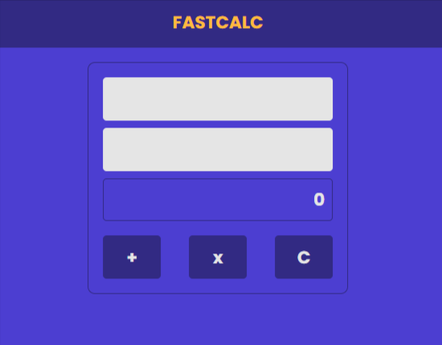

# FASTCALC

> Módulo 09 - Javascript

Projeto referente ao Desafio 02 - Módulo 09
Curso de Formação Desenvolvedor Moderno -
DEVSuperior

Foi utilizado no projeto:

- Manipulação de DOM;
- Eventos;

Efeito esperado:

- O formulário inicia limpo e a caixa de resultado com o valor 0;
- Ao clicar no botão “+”, irá aparecer na caixa de resultado a soma dos valores digitados nas caixas
  de texto. Se houver um ou mais valores nas caixas de texto que não são números válidos, a mesma ficará marcada de vermelho e a caixa de resultado inalterada;
- Ao clicar no botão “x”, irá aparecer na caixa de resultado a multiplicação dos valores digitados nas caixas de texto. Seguindo os mesmos efeitos da soma no caso de valores inválidos;
- Ao clicar no botão “C”, todo formulário ficará limpo, e a caixa de resultado voltará com o valor 0 (zero).

[Clique aqui para acessar] (https://gisellebm.github.io/DevSuperior-Modulo09-Desafio-Calculadora/)

## Tecnologias

- HTML
- CSS
- Javascript
- Git e Github

## Contato

gisellemacedo.dev@gmail.com
